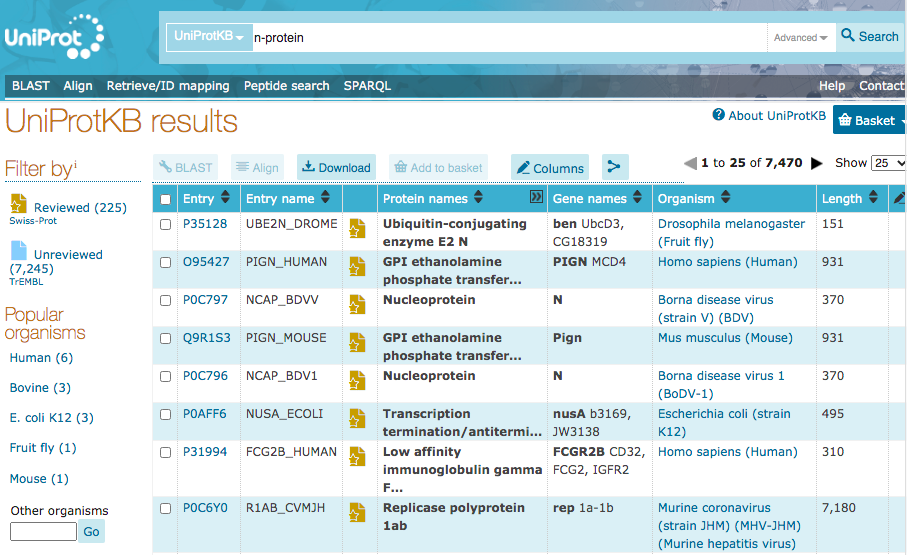

# Database Systems (CS305) Lab 2 Assignment (Part 1)

Creating a large-scale and persistent database using **one** table

**Assigned** : Tuesday 9 September 2025

**Due** : Tuesday 16 September 2025



## Project Goals
The main goals of this work include the following.

* To learn how to install create a large-scale and persistent database from real world data
* To gain experience writing queries to filter out a subset of the superset of data

## Resources

* SQLite3: [https://www.sqlite.org/index.html](https://www.sqlite.org/index.html)

* Uniprot: [https://www.uniprot.org/](https://www.uniprot.org/)

## Introduction

In Bioinformatics research, much of an investigator’s time is spent simply managing and organizing data for study. In this lab, you are the investigator in bioinformatics! Your task is to create a simple relational database from data concerning proteins which have been studied by their association to COVID-19. Here we will be studying the nucleocapsid protein (N-protein) which is encoded by all coronaviruses, including the SARS-CoV-2 that was first detected in Wuhan City, China, in December 2019. A formal description of the N-protein may be found at [https://www.raybiotech.com/covid19-proteins/](https://www.raybiotech.com/covid19-proteins/).

We will use relational data modeling to create a database, and will apply SQL programming to create tables, populate them and to perform our queries. This assignment focuses on making a database from scratch, designing the tables using the `CREATE TABLE` keywords, and then writing queries using the `SELECT` and `WHERE` keywords in SQL.

## Datasets

All of your data will come from Uniprot [http://www.uniprot.org](http://www.uniprot.org) (one of the world’s leading resources of protein knowledge), and will be used to create a local database for information from these proteins. To make this lab easier, the data will be provided to you for this lab and can be found as the data file; `src/data/uniprot-n-protein.tab`. 

## The Build File

We will be preparing a build file to automatically create your protein database from file imports. This file contains all code that you otherwise would have had to type in manually to create the database and allows you to conveniently rebuild your database for any reason. Please edit the file `src/proteinDB_build.txt` of your repository - you are to edit the table creation code of the build file to make your database.

Your build file (`src/proteinDB_build.txt`) will have the below form.

``` SQL
/*Build your tables*/

DROP TABLE IF EXISTS sprot;
CREATE TABLE sprot (...);

/* Import your data files. Use the below `.import` code to populate the tables from above. */
/* Note: If your data is not separated by tabs, then change the following line to reflect the delimiter. */

.separator "\t"

/* Find the data files in data/ and load them into SQLite3 to populate the above table.*/

.import data/uniprot-n-protein.tab nprot

/* How to run this builder? Use the below line. */
/* cat proteinDB_build.txt | sqlite3 proteinDB.sqlite3 */
```

---

## Deliverables

You are to build a database using protein data. The details may be found in your lab assignment sheet.

 - Your source code to build your database is to be submitted in the builder file; `src/proteinDB_build.txt`.

 - Your queries and their results are to be submitted in the file; `writing/queries.md`.


Note: If you would like to add screenshots to your work, please use the the following code;

```

```

The following html code serves to scale-down your graphic.

```

```


## Technical Information

### Git

Practicing software developers normally use a version control system to manage most of the artifacts produced during the phases of the software development life cycle.

In this course, we will always use the `git` distributed version control system to manage the files associated with our course. In particular, we will use this secure resource to submit our all our assignments and projects.

To help you get started with installing course software, our course [resources page](https://www.oliverbonhamcarter.com/resources/), contains URL links to download sites and important tutorials.

Note, if you are using a Mac or Linux machine, you may already have this software installed; try typing `git` at your terminal to check. On a MacOS machine, this command will ask you whether you wish to install `xCode`. Please follow the steps to install.

 If you are using a Windows machine then it is likely that you will need to install the software. Ask a Technical Leader or your instructor for help as necessary.

### Create your account on GitHub

It is assumed that you already have an account on GitHub but if you do not, then please visit [github.com](http://www.github.com) to create your account using your Allegheny email address. Follow the account generation links to create an account on GitHub using a normal name (to identify you) and be sure to add a current photo of yourself when completing your profile.

### Add Your SSH Keys to your account

SSH keys allow you to interact with GitHub using secure means. Using these keys, you can conveniently push and pull data from GitHub without having to input your user name and password each time. When developing code, it will be desirable to make frequent pushes to GitHub with your code so that any problems or bugs, can be isolated with the development of specific parts of code.

To learn more about creating and adding your ssh keys to your GitHub account. Please visit https://www.ssh.com/ssh/keygen/ to learn how to set-up your security keys. Let the instructor know if you have any questions with this task. For more information about ssh keys, please watch Professor Luman’s SSH Key [video](https://www.youtube.com/watch?v=qEPjUGQFmzQ&list=PLsYZRXov75ZHSwWiCk0-jd1RcTuu_-zmD).

### Submitting Assignments
As you are working on your lab, you are to commit and push regularly. The commands are the following.

```
git add -A
git commit -m ‘‘Your notes about commit here’’ 
git push
```

## Project Assessment

The grade that a student receives on this assignment will have the following components.

- **GitHub Actions CI Build Status [up to 50%]:**: For the lab repository associated with this assignment students will receive a checkmark grade if their last before-the-deadline build passes. This is only checking some baseline writing and commit requirements as well as correct running of the program. An additional reduction will given if the commit log shows a cluster of commits at the end clearly used just to pass this requirement. An addition reduction will also be given if there is no commit during lab work times. All other requirements are evaluated manually.

- **Mastery of Technical Writing [up to 50%]:**: Students will also receive a checkmark grade when the responses to the writing questions presented in the `reflection.md` reveal a proficiency of both writing skills and technical knowledge. To receive a checkmark grade, the submitted writing should have correct spelling, grammar, and punctuation in addition to following the rules of Markdown and providing conceptually and technically accurate answers.

## GatorGrade

### Checks for GatorGrade

For immediate feedback on submissions, we will be using Gator Grade to inform the of missing components in the submission. As you submit, you will notice that there is a thick red X that will change to a green check mark when all components have been included in the submission. You are encouraged to click on the red X to find a listing of the components to address.

You can check the baseline writing and commit requirements for this lab assignment by running department's assignment checking `gatorgrade` tool. To use `gatorgrade`, you first need to make sure you have Python3 installed (type `python --version` to check). If you do not have Python installed, please see:

- [Setting Up Python on Windows](https://realpython.com/lessons/python-windows-setup/)
- [Python 3 Installation and Setup Guide](https://realpython.com/installing-python/)
- [How to Install Python 3 and Set Up a Local Programming Environment on Windows 10](https://www.digitalocean.com/community/tutorials/how-to-install-python-3-and-set-up-a-local-programming-environment-on-windows-10)

Then, if you have not done so already, you need to install `gatorgrade`:

- First, [install `pipx`](https://pypa.github.io/pipx/installation/)
- Then, install `gatorgrade` with `pipx install gatorgrade`

Finally, you can run `gatorgrade`:

`gatorgrade --config config/gatorgrade.yml`

## Seeking Assistance

* Extra resources for using markdown include;
  + [Markdown Tidbits](https://www.youtube.com/watch?v=cdJEUAy5IyA)
  + [Markdown Cheatsheet](https://github.com/adam-p/markdown-here/wiki/Markdown-Cheatsheet)
* Do not forget to use the above git commands to push your work to the cloud for the instructor to grade your assignment. You can go to your GitHub repository using your browser to verify that your files have been submitted. Please see the TL’s or the instructor if you have any questions about assignment submission.

Students who have questions about this project outside of the lab time are invited
to ask them in the course's Discord channel or during instructor's or TL's office hours.
